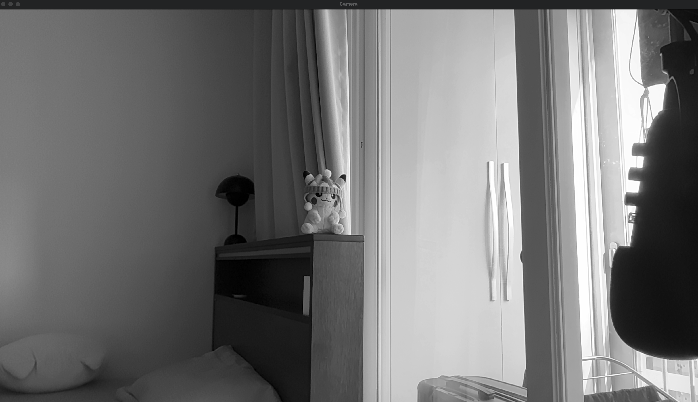

# 📹 Smart Video Recorder with OpenCV  

이 프로젝트는 Python의 OpenCV 라이브러리를 사용하여 스마트 비디오 레코더를 구현한 것입니다.  
카메라를 활용하여 영상을 실시간으로 촬영하고, 다양한 기능을 추가하여 사용자가 원하는 방식으로 녹화할 수 있도록 설계되었습니다.
또 카메라를 설정했을 때, 높이와 넓이 그리고 Fps를 카메라에 맞게 가져옵니다.

## 🎥 기능  

- **스페이스바 (`Space`)** : 녹화 시작 / 중지

- **D 키 (`D`)** : 다크 모드 (흑백 변환)  
- **F 키 (`F`)** : 좌우 반전 모드  
- **ESC 키 (`ESC`)** : 프로그램 종료  

## 🛠 사용 방법  

1. Python과 OpenCV가 설치된 환경에서 실행하세요.  
2. 프로그램을 실행하면 카메라 영상이 출력됩니다.  
3. cv2.VideoCapture()을 활용하여 원하는 카메라를 선택하세요.
3. 위의 단축키를 사용하여 다양한 기능을 적용해보세요.  
4. 녹화된 영상은 `output.mp4` 파일로 저장됩니다.

## 🖼️ 작동 화면 

### 📌 녹화 전 (Before Record)  
  

### 🌑 다크 모드 (Dark Mode)  
  

### 🔄 좌우 반전 모드 (Flip Mode)  
  

### 🎥 녹화 중 (Recording)  

## 📺 예시 영상
- 폴더 내 output.mp4 영상을 통해 녹화 예시 영상을 확인하실 수 있습니다.   
